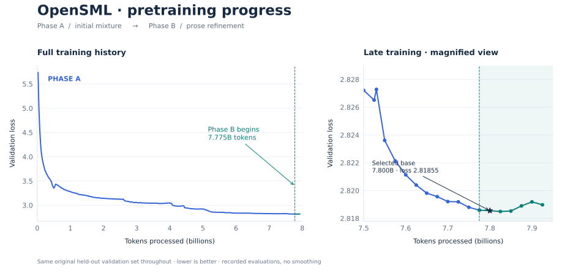

# OpenSML-150M

**A 150.44M-parameter language-model research project, from tokenizer training and pretraining to supervised fine-tuning, evaluation, and native MLX inference.**

**Author:** William Zebrowski

[Model card](https://huggingface.co/wzebrowski/OpenSML-150M) · [Tokenizer](sml-mlx-v1/tokenizer/bytebpe32k_v1/) · [Technical report](sml-mlx-v1/docs/TECHNICAL_REPORT.md) · [Training and reproducibility](TRAINING_AND_REPRODUCIBILITY.md) · [Run guide](RUN_GUIDE.md) · [Source notice](SOURCE_NOTICE.md)

OpenSML-150M explores small-language-model training on Apple Silicon with a custom byte-level BPE tokenizer, **7.800B pretraining tokens**, three supervised fine-tuning stages, and evaluations of both completion likelihood and instruction following.

The selected **research checkpoint is OpenSML-150M, SFT step 768**. This repository contains its code, recipes, tokenizer, recorded results, and documentation. Model weights are not yet published.

## At a glance

| Component | Selected configuration |
| --- | --- |
| Parameters | 150.44M; detailed accounting in the technical report |
| Transformer | 20 layers; hidden width 768; feed-forward width 2,048 |
| Attention | Grouped-query attention: 12 query heads / 4 key-value heads |
| Architecture | RoPE, RMSNorm, Q/K normalization, SwiGLU, tied input/output embeddings |
| Tokenizer | Independently fitted 32,000-token byte-level BPE |
| Context | 2,048 tokens, including the generation budget |
| Pretraining | 7,800,086,528 tokens across Stage A and Stage B |
| Training hardware | Four-Mac cluster, later expanded to five Macs with Thunderbolt RDMA |
| Native implementation | MLX on Apple Silicon; BF16 training with FP32 master weights |



*Recorded held-out validation loss without smoothing. The star identifies the selected pretrained base; later observations are outside its training exposure. See the [technical report](sml-mlx-v1/docs/TECHNICAL_REPORT.md) for validation sets, per-source curves, and training details.*

## What this project investigates

The project examines how a small model learns from a mixed pretraining corpus and how supervised fine-tuning changes instruction following while retaining earlier capabilities.

Pretraining combines FineWeb-Edu, DCLM-Edu, FineWiki, and Cosmopedia v2. Fine-tuning adds public instruction, reading-comprehension, science, and constraint-following examples, with replay from earlier stages.

The selected model follows this direct training path:

```text
Stage A → Stage B base (step 73,243) → Unified384 → Repair512 → OpenSML-150M
                                       +384        +128        +256 updates
                                                               SFT step 768
```

All parameters were updated during these fine-tuning stages. The selected model uses no LoRA or parameter interpolation. Supporting experimental recipes in this repository are not all ancestors of the selected checkpoint. Dataset mixtures, source pins, optimizer schedules, and checkpoint boundaries are recorded in the [technical report](sml-mlx-v1/docs/TECHNICAL_REPORT.md).

## Results at a glance

Fine-tuning improved both ARC metrics relative to the pretrained base. PIQA declined slightly; HellaSwag raw accuracy rose slightly while normalized accuracy declined. Instruction-following results apply to the selected SFT checkpoint.

### Zero-shot likelihood benchmarks

| Model | ARC-Easy acc / acc_norm | ARC-Challenge acc / acc_norm | PIQA acc / acc_norm | HellaSwag acc / acc_norm |
| --- | ---: | ---: | ---: | ---: |
| Pretrained base | 54.67% / 48.53% | 23.38% / 26.88% | 65.23% / 64.36% | 30.21% / 34.44% |
| **OpenSML-150M (SFT)** | **56.65% / 55.43%** | **26.02% / 29.52%** | 64.53% / 64.09% | 30.55% / 33.94% |

<details>
<summary>Likelihood evaluation protocol and dataset sizes</summary>

ARC-Easy: 2,376 test examples; ARC-Challenge: 1,172 test examples; PIQA: 1,838 validation examples; HellaSwag: 10,042 validation examples. The native evaluator scores zero-shot completion likelihood with FP32 scoring, reference MLX attention, batch size 1, and no chat template or inserted BOS/EOS.

`acc` ranks summed candidate log-likelihood. `acc_norm` divides by candidate Unicode-character count, excluding the leading delimiter. This follows pinned harness conventions but is not a full installed lm-evaluation-harness run. Benchmark reuse during development limits evaluation independence. Pins and integrity receipts are in the report and [results record](results/OPENSMl_150M_RESULTS.json).

</details>

### Instruction following: IFEval

| Model | Prompt strict | Instruction strict | Prompt loose | Instruction loose | 1,280-token cap hits |
| --- | ---: | ---: | ---: | ---: | ---: |
| OpenSML-150M | 15.16% (82/541) | 25.30% (211/834) | 15.71% (85/541) | 25.78% (215/834) | 33/541 |

Generation is zero-shot and greedy, using plain `User: {prompt}\nAssistant:` formatting with no added system message. All 541 prompts and 834 instructions were scored as produced by programmatic strict/loose verifiers, including responses reaching the token cap. No LLM judge is used.

**Benchmark scores do not establish chat reliability.** Complete-answer correctness has not received a systematic independent review. Development checks still show repetition and limited constraint completion. No MT-Bench or coding-success score is claimed for the selected model. Published external-model comparisons and their source records are in the [technical report](sml-mlx-v1/docs/TECHNICAL_REPORT.md).

## Run the model

Native inference uses MLX on Apple Silicon. **A released weight export and tested standalone inference bundle are still pending**, so this repository does not yet offer a download-and-generate quick start.

The included playground supports existing local checkpoint bundles. Its prerequisites and the archived training entry points are described in the [run guide](RUN_GUIDE.md). Cross-framework exports and inference parity remain unverified.

## Intended use and limitations

OpenSML-150M is intended for small-language-model research and controlled experimentation. Generated answers may be incorrect, repetitive, biased, or unsafe. Production use, tool use, broad multilingual capability, and extended dialogue remain unvalidated. A comprehensive contamination audit has not been established.

## Train and evaluate

The repository preserves Stage A/B pretraining, tokenizer fitting, selected SFT recipes, likelihood and IFEval evaluation, and MT-Bench tooling. To inspect the entry points and required inputs, follow the [run guide](RUN_GUIDE.md).

Set up Python 3.11+ on Apple Silicon:

```bash
python3 -m venv .venv
source .venv/bin/activate
python -m pip install -r requirements.txt
python scripts/verify_snapshot.py

cd sml-mlx-v1
python -m sml_v1.launch --help
python stage_b/launch.py --help
```

The production runtime used a custom MLX/JACCL build. Package pins provide a baseline environment; they do not establish numerical or distributed parity. See the [runtime notes](sml-mlx-v1/docs/MLX_NATIVE_BUILD.md).

Weights, optimizer state, raw datasets, and prepared training pools are external prerequisites. Some historical guards require original assets and readiness manifests. The archive is not a verified one-command reproduction; using different data or training beyond retained stage boundaries produces a different checkpoint.

## Navigate the repository

| Location | Purpose |
| --- | --- |
| [sml-mlx-v1/sml_v1/](sml-mlx-v1/sml_v1/) | Model architecture, streaming data, tokenizer fitting, optimization, and pretraining |
| [configs/](sml-mlx-v1/configs/), [stage_b/](sml-mlx-v1/stage_b/) | Stage A/B configurations and launch code |
| [tokenizer/](sml-mlx-v1/tokenizer/bytebpe32k_v1/) | Frozen tokenizer artifacts and audit |
| [experiments/](sml-mlx-v1/experiments/), [sft/](sml-mlx-v1/sft/) | Selected SFT lineage and supporting recipe implementations |
| [evaluation/](sml-mlx-v1/evaluation/) | Likelihood, IFEval, and MT-Bench tools |
| [scripts/](sml-mlx-v1/scripts/), [cluster/](sml-mlx-v1/sml_v1/cluster/) | Native playground and cluster helpers |
| [tests/](sml-mlx-v1/tests/) | Pipeline checks |
| [docs/](sml-mlx-v1/docs/), [figures/](docs/figures/) | Technical report, operational guides, and training charts |
| [results/](results/), [provenance/](provenance/) | Recorded scores, checkpoint metadata, runtime details, and source hashes |

This dedicated repository names its pipeline V1. Frozen tokenizer/checkpoint contracts and provenance retain original identifiers and source paths for compatibility. Historical operational guides may describe earlier branches or assets outside this archive.

## Licensing and sources

Author-controlled contributions use [Apache-2.0](LICENSE). Third-party code and training materials retain their own terms; see the [source notice](SOURCE_NOTICE.md). SFT includes SQuAD v2 and SciQ with differing upstream terms. Repository metadata does not grant blanket commercial rights to all training materials; weight-release licensing review remains pending.

Citation metadata is available in [CITATION.cff](CITATION.cff). See [third-party notices](THIRD_PARTY_NOTICES.md) for component attribution.
