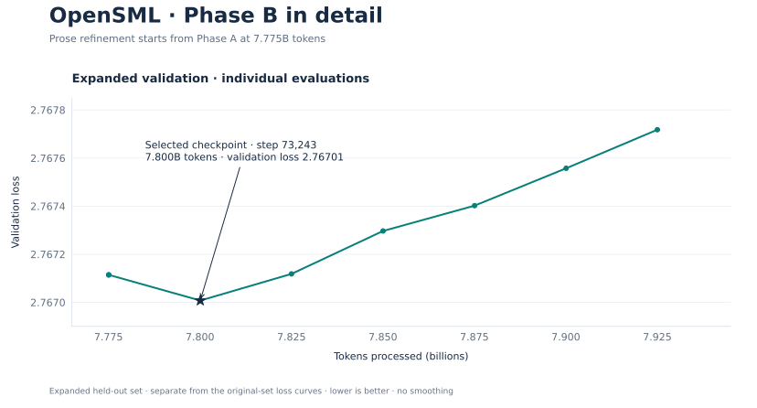
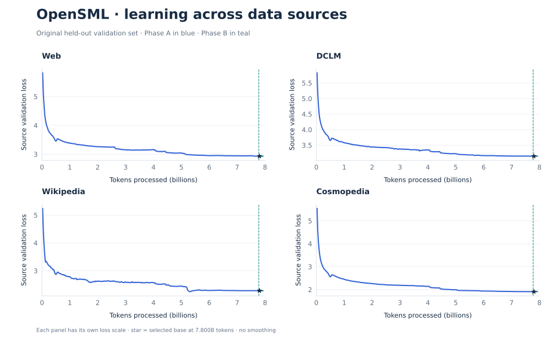

# OpenSML-150M — Technical Report

William Zebrowski · V1 training and selected post-training checkpoint · Updated October 2, 2026

This report is the detailed companion to the OpenSML-150M model card. The current
record below covers the V1 base at Stage B step 73,243 (7,800,086,528 pretraining
tokens) and the selected SFT checkpoint at total step 768. The September 18
report is preserved in a clearly dated historical appendix; its training status,
hardware, and unfinished-evaluation statements describe that earlier boundary.
Current selection and release statements below take precedence.

## Parameter-count accounting note

The owner-requested model-card wording reports 150,439,188 parameters (150.44M).
The existing architecture accounting and configuration records total 150,439,168.
This 20-parameter discrepancy is unresolved; the presentation edit was not a
model-weight change. The original component accounting is preserved in the
historical appendix.

## Current V1 Training and Evaluation Record

## Availability and Inference

This repository currently documents the selected fine-tuned model and its pretrained
base, and provides their shared tokenizer
and historical configuration files. It does not provide model weights or a tested
standalone inference bundle. A download-and-generate quick start is therefore not
yet available. The local project uses native MLX inference on Apple hardware;
compatibility with Transformers AutoModel, GGUF, ONNX, vLLM, and llama.cpp has not
been established for this repository. The selected SFT checkpoint uses the native plain User/Assistant format described
below; the pretrained base remains a completion model.

## At a Glance

| Item | Configuration |
| --- | --- |
| Model type | Decoder-only language model; selected instruction-tuned checkpoint with base results separately reported |
| Initialization | Random weights; no pretrained model initialization |
| Parameters | 150,439,168 |
| Backbone | 20 layers, width 768 |
| Context | 2,048 tokens |
| Tokenizer | Independently trained 32,000-token byte-level BPE |
| Training framework | MLX, with custom training and cluster orchestration |
| Five-Mac cluster | One M5 Ultra, one M3 Ultra, and three M4 Max machines |
| Communication | Native JACCL over Thunderbolt RDMA; four-node ring initially, five-node continuation |
| Selected pretrained base | Step 73,243; 7,800,086,528 lifetime pretraining tokens |
| Original exposure target | 15B total tokens; a plan, not the completed exposure of the selected base |
| Selected fine-tuned model | OpenSML-150M; total SFT step 768 |
| Current status | Base and selected SFT checkpoint documented; weight release pending |

## Model Specification

| Field | Value |
| --- | --- |
| Unique parameters | 150,439,168 |
| Layers / hidden width / FFN width | 20 / 768 / 2,048 |
| Attention | GQA: 12 query heads / 4 KV heads; head dimension 64 |
| Position encoding | RoPE, base 10,000 |
| Normalization / MLP | RMSNorm, Q/K normalization, SwiGLU |
| Vocabulary / context | 32,000 / 2,048 |
| Embeddings | Tied input and output |
| Linear biases / dropout | Neither used |
| Pretraining precision | BF16 compute; FP32 master weights and optimizer state |
| Benchmark precision | FP32 scoring, explicit vanilla MLX attention |

### Architecture

The model uses grouped-query attention with 12 query heads and 4 key/value heads
(head dimension 64), rotary position embeddings with base 10,000, RMSNorm, Q/K
normalization, and SwiGLU feed-forward layers with intermediate width 2,048.
Input and output embeddings are tied; linear layers are bias-free.

The tied vocabulary matrix contains 24,576,000 parameters. Initialization uses
normal standard deviation 0.02 with residual output projections scaled by
1/sqrt(2L). These are established Transformer components in our configuration,
not a claim of a new attention architecture.

## Pretraining Data

The model uses a prose-first mixture streamed from Hugging Face. This replaces
the earlier OpenWebText description on this page; that description does not apply
to OpenSML-150M.

| Source | Initial token share | Stage B token share | Selection |
| --- | ---: | ---: | --- |
| [FineWeb-Edu](https://huggingface.co/datasets/HuggingFaceTB/smollm-corpus) | 55% | 55% | `fineweb-edu-dedup` |
| [DCLM-Edu](https://huggingface.co/datasets/HuggingFaceTB/dclm-edu) | 25% | 20% | `edu_int_score >= 3` |
| [FineWiki](https://huggingface.co/datasets/HuggingFaceFW/finewiki) | 10% | 15% | English |
| [Cosmopedia v2](https://huggingface.co/datasets/HuggingFaceTB/smollm-corpus) | 10% | 10% | Textbook/tutorial/blog/educational format filter |

The [original corpus recipe](../configs/corpus.json) records the initial mixture.
Stage B began at step 73,008, after 7,775,059,968 tokens, and changed the mixture
as shown above. No dedicated code or math source was included in this prose
pretraining mixture; prose can still contain technical material, equations,
and code.

Pretraining uses three dataset repositories: FineWeb-Edu and Cosmopedia
v1 are two distinct subsets of SmolLM Corpus. All four pretraining sources are
listed above. Dataset tags also include the public sources used across the
selected checkpoint's SFT lineage, described below.

Normalized document hashes assign 97% to training and 1% each to tokenizer
development, validation, and a reserved final split. Original text is preserved
for model input. A bounded window of 10,000 recent accepted hashes suppresses
nearby exact duplicates across sources; it is not complete corpus deduplication
or a benchmark contamination audit.

Early training read each source in dataset order without a document shuffle
buffer. From step 70,710 (7,530,332,160 tokens), the data-review continuation
introduced a resumable 256-document shuffle buffer per source. This is bounded
shuffling, not a global random permutation. Documents receive one explicit EOS
and are packed into causal windows that can cross document boundaries;
attention is not reset at every document.

Mac-1 handles filtering, tokenization, and RAM prefetch, then distributes disjoint
rank slices. The training path does not save corpus/token shards to disk.
Checkpoint cursors, tokenizer-fitting samples, logs, staged files, and small HF
metadata caches are separate storage uses. Exact-resume state tracks consumed
batches, not the prefetch worker's advanced position.

## Tokenizer

**ByteBPE32K v1 is completed and frozen.** It was fitted on our source mixture,
not borrowed from another model. Tokenizer-fitting shares are measured in UTF-8
bytes; pretraining shares are measured in tokens.

| Audit item | Recorded result |
| --- | --- |
| Fitting sample | 500,048,186 UTF-8 bytes; 113,898 documents |
| Held-out audit | 4,010,605 bytes; 970 documents |
| Vocabulary | Exactly 32,000 IDs including structural tokens |
| Round-trip failures | Zero across the held-out audit |
| Regression fixtures | 9 passed |
| Special IDs | Padding 0; document-end 1; turn-start 2; turn-end 3 |
| Encoding | Full byte alphabet; no text normalization or implicit BOS/EOS |

Literal control-token spellings encode as ordinary text. Reserved turn tokens
do not mean the base model has been chat-trained. The selected SFT model uses
plain role labels and document-end EOS rather than relying on those reserved turn tokens. Held-out bytes/token were
4.6255 for web, 4.4532 for DCLM, 4.0593 for wiki, and 5.0610 for Cosmopedia.
These are encoding checks, not model capability results.

Files: [tokenizer](../tokenizer/bytebpe32k_v1/tokenizer.json),
[configuration](../tokenizer/bytebpe32k_v1/tokenizer_config.json),
[manifest](../tokenizer/bytebpe32k_v1/manifest.json), and [audit](../tokenizer/bytebpe32k_v1/report.json).
The artifact is provided with its structural-token contract; standard text
encoding alone does not reproduce every custom trainer boundary rule.

```text
Tokenizer artifact fingerprint:
1194292c6d906ac19e6f01c6ad2b42825143fad426a22aa8856d903776701ecb
```

## Training Method

| Setting | Value |
| --- | --- |
| Optimizer | AdamW; betas 0.9/0.95; epsilon 1e-8 |
| Precision | BF16 compute; FP32 master weights, moments, and accumulated/reduced gradients |
| Regularization | Matrix weight decay 0.1; gradient norm clip 1.0 |
| Local microbatches | Initially 4 / 3 / 3 / 3; five-Mac continuation 4 / 3 / 2 / 2 / 2 sequences |
| Gradient accumulation | 4 |
| Global update | 52 sequences; 106,496 tokens |
| Learning rate | Initial peak 3e-4; later validation-plateau schedule, then 5e-6 floor; selected Stage B base used 5e-6 |
| Validation / samples | Every 25M / 50M tokens |
| Routine checkpoint saves | Every 10M tokens, plus best/final/clean-stop saves |

### Four-to-five-Mac training history

The original cluster used one M3 Ultra and three M4 Max Mac Studios. At step
**50,096**, after **5,335,023,616 tokens**, training continued with an M5 Ultra
coordinator added to form a five-Mac ring. This transition is recorded in the
selected pretrained checkpoint's provenance; the model was not trained on
five Macs from initialization.

| Machine | Unified memory | Local microbatch | Tokens per global update |
| --- | ---: | ---: | ---: |
| M5 Ultra | 96 GB | 4 | 32,768 |
| M3 Ultra | 96 GB | 3 | 24,576 |
| M4 Max | 36 GB | 2 | 16,384 |
| M4 Max | 36 GB | 2 | 16,384 |
| M4 Max | 36 GB | 2 | 16,384 |

The physical ring is **Mac-1 → Mac-2 → Mac-3 → Mac-5 → Mac-4 → Mac-1**.
This is replicated data parallelism: each Mac holds the complete model and
optimizer, processes disjoint examples, combines gradients with batch-size
weighting, and applies the same update. It is not a model split across five
machines. Mac-1 streams/tokenizes the corpus, distributes batches, evaluates,
and saves checkpoints.

Native JACCL over Thunderbolt RDMA carries tensors. Ethernet/SSH and
job-scoped coordinator tunnels handle control traffic. With context 2,048 and
four accumulation steps, the five-Mac allocation preserves the earlier effective
batch: `(4 + 3 + 2 + 2 + 2) × 4 × 2048 = 106,496` tokens per update.
The transition preserves architecture, tokenizer and optimizer state. No
controlled four-versus-five-Mac throughput comparison is claimed.

The implementation uses compiled backward computation, fast attention, custom
Metal cross-entropy, and packed SwiGLU. Their presence is not, by itself, evidence
of a measured speedup for each individual optimization.

### Pilot and Continuation

The pilot finished at step 4,696 after 500,105,216 tokens. It used token-based
warmup, a stable phase, and a final cosine decay to 3e-5. The initial continuation restored
its weights, optimizer and consumed data cursor, reheated to 3e-4 over 50M
additional tokens, and originally targeted 15B total tokens. Later training
changed schedules through explicit checkpoint transitions: a validation-plateau
controller at step 38,056; a lower-LR continuation at step 60,263; and the
shuffle/validation transition at step 70,710. Stage B began from step 73,008
at 5e-6. The selected Stage B base is step **73,243**, with **7,800,086,528**
lifetime pretraining tokens.

This is **not a single unchanged 15B schedule from initialization**, and the
15B target must not be read as the training exposure of these checkpoints.
The linked [pilot](../configs/pilot.json) and [early continuation configuration](../configs/training_recipe.json)
are historical recipes; the later transitions are summarized here.

## Training and Model Lineage

The selected fine-tuned model is **OpenSML-150M**, retained by the
project owner as the current baseline. Its internal experiment identifier is
Trial 28 — Repair512 +256; that identifier remains in provenance records only. Its ancestry is:

```text
Pretrained V1: Stage B step 73,243 (7.800B pretraining tokens)
  → Unified384: 384 supervised updates from the base
  → Repair512: 128 additional public-repair updates
  → OpenSML-150M: 256 additional updates; total SFT step 768
```

These SFT labels are update counts, not pretraining steps or token counts.
This step 768 is distinct from the earlier Text Follow-up 768 branch. The model
is a direct fine-tuned checkpoint, without parameter interpolation. Other search
candidates are separate experiments and are not ancestors of these weights.

### Fine-tuning Data and Settings

| Stage | Data and method | Retained exposure |
| --- | --- | --- |
| Unified384 | Smol-SmolTalk and UltraChat conversations, writing/summarization, authored recovery/format follow-ups, SQuAD v2 passage reading, and ARC training questions; assistant-only supervised learning | First 384 updates of the 768-update recipe |
| Repair512 | Short Smol-SmolTalk/UltraChat chats, Dolly ordinary and grounded answers, and verified Tulu 3 Persona instruction examples; assistant-only supervised learning | 128 additional updates from Unified384 |
| OpenSML-150M | SmolTalk constraints, SQuAD v2 training passages, SciQ training labels, and Repair512 replay; supervised learning with repetition and retention objectives | 256 additional updates; first 4,096 ordered training records |

Trial 28 prepared an 8,192-record, 512-update experiment. Its retained checkpoint
is the **+256 midpoint**, not the final +512 model. The full prepared mixture was
3,072 SmolTalk constraint records, 2,048 SQuAD records, 1,024 SciQ records, and
2,048 replay records, including repeated passes through fresh examples. Those
full-plan counts must not be interpreted as the retained midpoint's exposure.

Trial 28 updates all model parameters, including tied embeddings; no LoRA or
frozen-layer restriction is used. It retains the architecture, context length,
and tokenizer of the base. Batches contain 16 whole conversations. Supervised
cross-entropy weights conversations equally and trains assistant targets plus
EOS while masking prompt/history positions. Targets are retained whole; records
that exceed length/context limits are excluded.

The Trial 28 optimizer uses AdamW, betas 0.9/0.95, zero weight decay, clipping at
norm 1, and a 16-update warmup to 2e-6 followed by cosine decay toward 2e-7 over
the planned 512 updates. The selected midpoint therefore stops partway through
that schedule. The objective adds a selective repetition unlikelihood term
(weight 0.3) and a frozen-Repair512 forward-KL retention term (weight 2), restricted
to replay examples. This is supervised post-training with auxiliary objectives;
it does not use DPO or a reward-model policy-optimization stage in this lineage.

Trial 28 source revisions are SmolTalk `5feaf2fd3ffca7c237fc38d1861bc30365d48ffa`,
SQuAD v2 `3ffb306f725f7d2ce8394bc1873b24868140c412`, and SciQ
`2c94ad3e1aafab77146f384e23536f97a4849815`.
Training preparation excludes known benchmark overlaps and separates development
and reserved records, but this is not a comprehensive contamination audit.
Public targets have not all received independent factual review.

Selection followed repeated development and public-benchmark comparisons.
Trial 28 passed the recorded benchmark gate but failed the chat-repetition
component of the development gate; the owner explicitly retained it. It is the
**selected current baseline**, not a statistically established best model across
all capabilities. Reused benchmarks are exploratory development evidence.

## Pretraining Loss Curves

These charts show recorded held-out next-token validation loss from the selected
pretraining lineage, without smoothing. **Blue is Phase A** (the initial mixture
and its continuations); **teal is Phase B** (the Stage B prose refinement).
Phase B starts at step **73,008**, after **7.775B tokens**. The star marks the
selected pretrained base at step **73,243**, after **7.800B tokens**. Later points
show continued pretraining beyond the selected checkpoint, not additional
training included in that checkpoint. Lower loss is better.

### Full History and Late-training Zoom


The overview and zoom use the **same original held-out set** throughout
(262,144 target positions). The zoom makes the shorter Phase B visible; its
vertical scale is magnified. Aggregate validation weights remain fixed at
55% web, 25% DCLM, 10% Wikipedia, and 10% Cosmopedia across both phases,
even though the Phase B training mixture changes. The selected checkpoint's
loss on this original set is **2.81855024**.

### Phase B Detail



This close-up uses the **expanded held-out set** (4,194,304 target positions),
introduced late in Phase A. Its absolute loss values are separate from the
original-set curves above and below. The selected checkpoint's expanded loss
is **2.76700753**. The tightly zoomed vertical scale shows small changes; the
later increase is less than 0.001 loss. Validation weights remain fixed to the
original reference mixture.

### Validation Loss by Data Source



Each source is evaluated on the original held-out set throughout. Panels use
their own vertical scales; they show each source's trajectory rather than a
common-scale ranking of source difficulty. The dashed line marks the Phase B
transition and the star marks the selected base.

## Interim Results

**Dated snapshot: September 18, 2026, through step 8,217. Not a live counter.**

| Selected milestone | Total tokens | Validation loss |
| --- | ---: | ---: |
| Pilot endpoint, step 4,696 | 500,105,216 | 3.3536 |
| Near end of continuation rewarm, step 5,165 | 550,051,840 | 3.4327 |
| Best at this snapshot, step 8,217 | 875,077,632 | 3.3078 |

These are selected milestones, not a complete learning curve. The loss rise and
recovery do not isolate the causal effect of reheating from additional training.

At step 8,217, per-source losses were web **3.4116**, DCLM **3.6108**, wiki
**2.7977**, and Cosmopedia **2.4896**. Evaluation uses 16 batches of two sequences
per source: 262,144 target positions in total. The aggregate applies the training
mixture weights. Pilot and continuation preserve the same held-out fingerprint.

One earlier production readout at step 7,980 reported 13,794 interval tokens/sec
and 13,578 run tokens/sec across the cluster. This is an observed counter, not a
controlled performance benchmark, utilization measurement, or total runtime.

## Selected Pretrained Base

The selected pretrained checkpoint is the preserved Stage B base at
step **73,243**, after **7,800,086,528 pretraining tokens**. Its original legacy
validation loss is **2.81855024**. Its expanded validation loss is **2.76700753**.
These are different evaluation sets and must not be merged into one loss curve.
The expanded set has 256 batches of two sequences per source, or 4,194,304
positions in total; the legacy set has 262,144 positions.

The historical September 18 milestones above remain a dated record, not the
current training counter. Lower next-token loss does not by itself establish
correct answers, reasoning, or reliable instruction following.

## Evaluation

Results identify either the **pretrained Stage B base at step 73,243** or the
**selected OpenSML-150M SFT checkpoint at total step 768**. Their identities and
results are kept separate. The pretrained weight SHA-256 is:

```text
ca9bd5d82005f28e77f319d3a5a29f29fb4e4f86e7ceea049f01162fd8aae80f
```

### Zero-shot Likelihood Benchmarks

The complete evaluation scored **15,428 multiple-choice examples**. Higher is
better; raw and normalized accuracy are separate metrics.

| Benchmark | Split | Examples | Pretrained base acc / acc_norm | OpenSML-150M acc / acc_norm |
| --- | --- | ---: | ---: | ---: |
| ARC-Easy | Test | 2,376 | 54.67% / 48.53% | 56.65% / 55.43% |
| ARC-Challenge | Test | 1,172 | 23.38% / 26.88% | 26.02% / 29.52% |
| PIQA | Validation | 1,838 | 65.23% / 64.36% | 64.53% / 64.09% |
| HellaSwag | Validation | 10,042 | 30.21% / 34.44% | 30.55% / 33.94% |

Under the recorded protocol, the selected SFT checkpoint improves both ARC
metrics over the base. PIQA is slightly lower; HellaSwag raw accuracy increases
slightly while normalized accuracy decreases. Fine-tuning therefore shows a
mixed result rather than uniform gains.

Scoring ranks supplied answer continuations by their summed log-likelihood
(`acc`). `acc_norm` divides that score by the candidate text's Unicode character
count, rather than token count. The evaluator uses plain task completion prompts,
no few-shot demonstrations, no chat template, and no added BOS/EOS tokens. It
loads the selected checkpoint in FP32, uses reference feed-forward operations
and explicit vanilla MLX attention, and scores one example at a time. No response
sampling or LLM judge is involved.

The custom evaluator follows the pinned lm-evaluation-harness task conventions
at revision `b954108c9baaaa934b4ad842033b31a97ee30816`; this is not an installed
harness run or an official leaderboard submission. All expected rows completed,
and the saved integrity receipt records unchanged inputs. Different prompt,
normalization, tokenizer, or numerical settings can change scores. These numbers
are not automatically comparable with external model cards. A comprehensive
pretraining contamination audit has not been established, and these are not
claimed to be untouched final-test results.

### Comparison with Small Language Models

**OpenSML-150M** is compared below with recognizable models in the same approximate
parameter range: GPT-2 (124M), OPT-125M, and Pythia-160M. All external values are
**previously published results**. OpenSML values are
our existing measurements of the selected fine-tuned checkpoint.

Each cell shows **acc / acc_norm**; **—** means the cited source does not report
that metric. Bold marks the highest available reported value in each column.
These are cross-source comparisons, not a controlled common-harness ranking.

| Model | ARC-Easy acc / acc_norm | ARC-Challenge acc / acc_norm | PIQA acc / acc_norm | HellaSwag acc / acc_norm |
| --- | ---: | ---: | ---: | ---: |
| **OpenSML-150M (SFT)** | **56.65% / 55.43%** | **26.02% / 29.52%** | **64.53% / 64.09%** | **30.55% / 33.94%** |
| [GPT-2 (124M, base)](https://huggingface.co/openai-community/gpt2) | — / 39.48% | — / — | — / 62.51% | 28.92% / 31.14% |
| [OPT-125M (base)](https://huggingface.co/facebook/opt-125m) | 43.52% / 39.98% | 18.94% / 22.78% | 63.00% / 62.02% | — / — |
| [Pythia-160M (base)](https://huggingface.co/EleutherAI/pythia-160m) | 43.52% / 39.65% | 18.77% / 23.29% | 62.73% / 61.64% | — / — |

**The strongest reported margin is ARC-Easy:** OpenSML-150M's normalized score
is +15.45 percentage points above OPT-125M and +15.78 points above Pythia-160M.
On normalized ARC-Challenge, the respective differences are +6.74 and +6.23
points. OpenSML also exceeds the available published PIQA and GPT-2 HellaSwag
values shown here. These differences describe the reported numbers, not
statistically established superiority under identical evaluation settings.

OpenSML uses the zero-shot native-MLX protocol described above, with
character-normalized `acc_norm`. External metrics retain their source definitions;
we have not verified identical prompts, normalization, precision, or dataset
revisions across all sources. OpenSML is instruction fine-tuned, whereas the
three references are pretrained base models. The comparison therefore does not
isolate architecture, pretraining quality, or instruction-following ability.
Missing external metrics have not been filled by running new evaluations.

### Instruction Following: IFEval

These results apply only to **OpenSML-150M**, not the pretrained base.

| Checkpoint | Prompt strict | Instruction strict | Prompt loose | Instruction loose | 1,280-token cap hits |
| --- | ---: | ---: | ---: | ---: | ---: |
| OpenSML-150M | 15.16% (82/541) | 25.30% (211/834) | 15.71% (85/541) | 25.78% (215/834) | 33/541 |

The evaluation completes all 541 official prompts and 834 instructions using
zero-shot greedy generation and the pinned programmatic strict/loose verifiers,
without an LLM judge. Each unchanged prompt is formatted as
`User: {prompt}\nAssistant:` with no added system message. Generation uses cached
native MLX decoding, context 2,048, a 1,280-new-token cap, document-end EOS ID 1,
no additional stop strings, and no repetition penalty. Outputs are scored as
produced, including length-capped answers. Of the responses, 508 stop at EOS,
33 reach the generation cap, and none hit the context limit.

The dataset's official split is named `train`; these evaluation examples are
not used as supervised training records in the documented experiment. Benchmark
inspection across multiple candidates nevertheless limits independence of model
selection. No pretrained-base IFEval score is reported here.

### Complete-answer Diagnostics

For OpenSML-150M, saved development generations cover 63 legacy-retention turns
and 73 public-development turns. The recorded follow-up joint proxy is 22/32;
5/32 public named-constraint checks pass. Repetition is detected on 4/63 legacy
turns and 18/73 public turns; in the chat subset it rises from Repair512's 3/18
to 4/18. These are development diagnostics and mechanical proxies, not
independent human-reviewed complete-answer correctness rates.

A systematic complete-answer review comparable to PetitGPT's published suite
has not been established for the selected checkpoint. Likelihood and IFEval
scores do not establish factual correctness or reliable conversational answers.

### Reading and Fact-sensitivity Diagnostics (Pretrained Base)

The following diagnostics apply to the pretrained base, not Trial 28.
A separate September 24 audit used **400-example subsets per task**, distinct
from the full benchmark results above. On the same selected rows, OpenSML base
and a pinned SmolLM2-135M **base** reference scored:

| Diagnostic | OpenSML base | SmolLM2-135M base |
| --- | ---: | ---: |
| PIQA | 65.00% | 66.00% |
| HellaSwag | 34.25% | 42.25% |
| BoolQ | 62.75% | 62.75% |

The reference revision was `93efa2f097d58c2a74874c7e644dbc9b0cee75a2`.
These are local matched-subset measurements, not the reference model's published
full-benchmark scores. Different data, architecture, tokenizers, and training
budgets prevent attributing the differences to pretraining exposure alone.

BoolQ accuracy did not establish reliable reading: OpenSML selected "yes" on
95.25% of items; without the passage it scored 58.75%. In a separate authored
fact-swap diagnostic, the model answered both variants correctly on **18/120
pairs** in question/answer format. Swapping the passage changes the correct
choice, so this diagnostic checks whether recognition follows supplied facts.
The pairs share templates and are not 240 independent task families.

### What These Results Establish

Likelihood benchmarks measure recognition among supplied choices. They do not
measure whether the model can independently write a factually correct, complete
answer. The reading diagnostics also score choices rather than complete assistant
responses. A systematic complete-answer evaluation comparable to a reviewed
free-form answer suite has not been established for this pretrained checkpoint.
IFEval for the selected SFT checkpoint is reported separately above. No
MT-Bench or coding-success score is claimed for that checkpoint.

## Checkpoint Identity and Verification

The pretrained checkpoint is `step_0073243_7f3070237eea`, selected from the Stage B run.
The selected SFT checkpoint is `step_0000768_4980617cb301`, with weight SHA-256:

```text
cbd3e3fb4ada74d7264371b79cee7598f513b7b950f1f141ef9f1a43bd2e1b4e
```

The SFT weight hash was verified against the retained bundle. Its full multiple-choice
and IFEval integrity receipts record 15,428 and 541 completed examples respectively,
with unchanged inputs. Checkpoint metadata pins Repair512 as its direct parent.
A portable [Trial 28 results and provenance record](../../results/OPENSMl_150M_RESULTS.json) preserves
exact scores, protocol settings, dataset pins, and source-record hashes.
Local evaluation records pin its weight hash, tokenizer fingerprint, dataset
revisions, evaluator source hashes, and runtime settings. The full-benchmark
integrity receipt records 15,428 completed examples with unchanged inputs.
The tokenizer round-trip audit is described above. These checks establish
artifact identity and the scope of the recorded evaluation; they do not establish
cross-framework inference parity or deployment readiness. A released-weight
export verification and reproducible inference guide remain pending.

## Limitations and Intended Use

The eventual model is intended for small-language-model research and controlled
experimentation. The selected checkpoint is instruction-tuned, but is not a validated production assistant. It may generate
incorrect, repetitive, biased, offensive, or unsafe text. Do not rely on it for
high-stakes decisions. Broader capability and safety assessments remain pending.

Architecture, tokenizer, data, and context differ from earlier experiments;
this run alone cannot attribute any improvement to a single change.

## Repository Contents and Release Plan

- This model card documents the selected SFT checkpoint, pretrained ancestry, and separately labeled evaluations.
- `configs/` contains the original pinned corpus and pilot/early-continuation recipes; these are historical, not the complete later training history.
- `tokenizer/` contains the completed tokenizer, its corpus contract, and audit.
- Model weights, optimizer states, raw datasets, credentials, and private network configuration are not included.

Before a weight release, freeze the selected checkpoint and evaluation evidence,
add tested inference instructions and necessary implementation code, and review
third-party attribution. No release date is promised.

## License

OpenSML-150M project contributions in this repository are licensed under the
[Apache License 2.0](../../LICENSE), for rights controlled by the author.
Upstream datasets and third-party materials retain their own licenses and
attribution requirements; the repository license does not relicense them.

Post-training sources also retain their own terms. Trial 28 source records list
SmolTalk as Apache-2.0, SQuAD v2 as CC-BY-SA-4.0, and SciQ as CC-BY-NC-3.0.
Apache-2.0 metadata for author-controlled project contributions is not a blanket
commercial-use license for all upstream materials or a completed weight-release
licensing review.

## External Benchmark Source Records

External comparison values are published measurements, not results from local
baseline evaluations. Incomplete local baseline runs are not used in the model card.

- GPT-2 normalized ARC-Easy and PIQA: [nano-chatgpt published table](https://github.com/Seif-Yasser-Ahmed/nano-chatgpt/blob/2c6b48b4e2eb612447b0858460c3d0472f00a98b/README.md#presentation-benchmark-table); shot counts are unspecified in that table. GPT-2 HellaSwag acc/acc_norm: [saved baseline JSON](https://github.com/Seif-Yasser-Ahmed/nano-chatgpt/blob/2c6b48b4e2eb612447b0858460c3d0472f00a98b/out_gpt2/10B/checkpoint_19072/evaluation_results/hellaswag_metrics.json). The project's comparison script invokes default HellaSwag few-shot settings. These are project measurements, not official OpenAI claims.
- OPT-125M: [EleutherAI baseline JSON](https://github.com/EleutherAI/pythia/blob/a19eecb807ec2c79a39ebf18108816e6ffffc1d5/evals/opt/opt-125m.json), `num_fewshot: 0`, `limit: null`; HellaSwag absent.
- Pythia-160M: [EleutherAI official non-deduplicated suite, step 143,000](https://github.com/EleutherAI/pythia/blob/a19eecb807ec2c79a39ebf18108816e6ffffc1d5/evals/pythia-v1/pythia-160m/zero-shot/160m_step143000.json), `num_fewshot: 0`, `limit: null`; HellaSwag absent.

## Retained SFT Dataset Exposure

These are record exposures, not token shares or unique-example counts. The
trainers consume ordered batches of 16 records. Tables count the first 6,144,
2,048, and 4,096 records at the three retained training boundaries respectively.

### Unified384

| Source | Record exposures | Share | Role |
| --- | ---: | ---: | --- |
| HuggingFaceTB/smol-smoltalk | 3,071 | 49.98% | Stage mixture |
| arc_easy | 198 | 3.22% | Stage mixture |
| HuggingFaceH4/ultrachat_200k | 1,761 | 28.66% | Stage mixture |
| authored-given-facts-v1 | 384 | 6.25% | Stage mixture |
| authored-fictional-text-v1 | 384 | 6.25% | Stage mixture |
| squad_v2 | 160 | 2.60% | Stage mixture |
| arc_challenge | 186 | 3.03% | Stage mixture |
| **Total** | **6,144** | **100%** | |

### Repair512

| Source | Record exposures | Share | Role |
| --- | ---: | ---: | --- |
| HuggingFaceTB/smol-smoltalk | 259 | 12.65% | Stage mixture |
| databricks/databricks-dolly-15k | 1,024 | 50.00% | Stage mixture |
| HuggingFaceH4/ultrachat_200k | 253 | 12.35% | Stage mixture |
| allenai/tulu-3-sft-personas-instruction-following | 512 | 25.00% | Stage mixture |
| **Total** | **2,048** | **100%** | |

### OpenSML-150M final continuation

| Source | Record exposures | Share | Role |
| --- | ---: | ---: | --- |
| allenai/tulu-3-sft-personas-instruction-following | 256 | 6.25% | Repair512 replay |
| HuggingFaceTB/smoltalk | 1,536 | 37.50% | Stage mixture |
| rajpurkar/squad_v2 | 1,024 | 25.00% | Stage mixture |
| databricks/databricks-dolly-15k | 512 | 12.50% | Repair512 replay |
| allenai/sciq | 512 | 12.50% | Stage mixture |
| HuggingFaceTB/smol-smoltalk | 132 | 3.22% | Repair512 replay |
| HuggingFaceH4/ultrachat_200k | 124 | 3.03% | Repair512 replay |
| **Total** | **4,096** | **100%** | |


## Historical Appendix — September 18, 2026

The following is the preserved original report at its 1B-token reporting boundary.
It is historical evidence, not the current model-card release status. Relative
links in this appendix refer to the original V1 documentation tree.

### Historical OpenSML-152M: Pretraining a Small Language Model on Apple Silicon

**William Zebrowski | Working technical report | September 18, 2026**

**Status: pretraining in progress.** Quantitative results below are frozen at
step 9,391, or 1,000,103,936 consumed training tokens. The planned endpoint is
15 billion tokens; it is not a completed result.

Project overview (`../README.md` in the original V1 documentation tree) | Data and tokenizer (`DATA_AND_TOKENIZER.md` in the original V1 documentation tree) |
Results notes (`RESULTS.md` in the original V1 documentation tree) | Evidence index (`EVIDENCE.md` in the original V1 documentation tree)

## Abstract

OpenSML-152M is an English-first, decoder-only language model trained from random
initialization on a four-Mac Studio cluster. Its implemented architecture contains
**150,439,168 trainable parameters**, with 20 Transformer blocks, a hidden width
of 768, grouped-query attention, tied embeddings, and a 2,048-token context.
The project name is a rounded model label, not the exact parameter count.

A custom 32,000-token byte-level BPE tokenizer was fitted to a representative
sample of the selected educational-prose corpus. Pretraining streams four
source components from three Hugging Face repositories, using a target token
mixture of 55% FineWeb-Edu, 25% DCLM-Edu, 10% English FineWiki, and 10% filtered
Cosmopedia. The training system combines BF16 computation with FP32 optimizer
state and gradients, unequal per-device batches, and Thunderbolt RDMA ring
communication through MLX/JACCL.

At the reporting boundary, aggregate development cross-entropy is **3.2812**
and perplexity is **26.61** on the fixed reference batches. These are interim
next-token prediction measurements, not downstream capability scores. Repetitive
and factually incorrect completions remain visible. This report documents the
implemented method and its evidence while leaving final evaluation, post-training,
and release claims explicitly open.

## Contents

1. [Scope and Reporting Conventions](#1-scope-and-reporting-conventions)
2. [Model Architecture](#2-model-architecture)
3. [Tokenizer](#3-tokenizer)
4. [Pretraining Data](#4-pretraining-data)
5. [Optimization and Training Schedule](#5-optimization-and-training-schedule)
6. [Distributed Execution](#6-distributed-execution)
7. [Checkpointing and Reproducibility](#7-checkpointing-and-reproducibility)
8. [Evaluation Methodology](#8-evaluation-methodology)
9. [Interim Results](#9-interim-results)
10. [Post-Training and Release Status](#10-post-training-and-release-status)
11. [Limitations and Intended Use](#11-limitations-and-intended-use)
12. [Evidence and Completion Checklist](#12-evidence-and-completion-checklist)

## 1. Scope and Reporting Conventions

### 1.1 Research objective

The objective is a useful small text-generation model with a traceable training
process on locally available Apple Silicon hardware. Throughput matters as a
resource constraint, but model selection is not based on throughput alone.
The architecture and mixture are this project's chosen configuration of
established components, not a claim of architectural novelty.

These weights were initialized from scratch. Earlier models and their
fine-tuning experiments are not ancestors of these weights and are not evidence
of this model's capabilities. Reused implementation components are separately
recorded in code provenance (`../provenance.json` in the original V1 documentation tree).

### 1.2 What the report distinguishes

| Term | Meaning here |
| --- | --- |
| Configured | Present in the recorded recipe or implemented code |
| Observed | Supported by an identified log, audit, or artifact |
| Planned | Not yet a completed experiment or measured outcome |
| Consumed training tokens | Token positions included in completed optimizer updates along this run's lineage |
| Validation loss | Cross-entropy on fixed held-out reference batches, not generated-answer accuracy |
| Best checkpoint | Lowest observed weighted validation loss under this evaluation contract |
| Latest checkpoint | Most recent successfully committed resumable state |

Validation records, qualitative probes, and future independent benchmarks are
different evidence types. Repeated use of reference batches makes them
development evidence, not an untouched final test. Results from another
tokenizer, corpus, or evaluation protocol are not directly comparable by raw loss.

### 1.3 Reporting boundary

This document is a versioned snapshot, not a live status dashboard. Training may
have advanced beyond the values shown. A machine-readable
validation table (`tables/validation_through_0009391.csv` in the original V1 documentation tree) and its
provenance record (`tables/validation_through_0009391.json` in the original V1 documentation tree) accompany this revision.
Earlier supporting notes may use earlier, explicitly dated cutoffs.

## 2. Model Architecture

### 2.1 Transformer configuration

| Component | Implemented value |
| --- | --- |
| Model family | Autoregressive, decoder-only Transformer |
| Trainable parameters | 150,439,168 |
| Transformer blocks | 20 |
| Hidden width | 768 |
| Context length | 2,048 tokens |
| Vocabulary | 32,000 |
| Query / key-value heads | 12 / 4 |
| Head dimension | 64 |
| Position representation | Rotary position embeddings; base 10,000 |
| Normalization | Pre-norm RMSNorm; per-head query/key RMSNorm; final RMSNorm |
| Feed-forward | SwiGLU; intermediate width 2,048 |
| Vocabulary interface | Shared input embedding and output projection |
| Linear biases / dropout | No linear biases; no dropout layers |

Each attention block uses a fused QKV projection. Its output width is
768 + 256 + 256 = 1,280. Grouped-query attention shares four key/value heads
across twelve query heads. The configured fast-attention path passes grouped
heads to MLX's scaled dot-product attention rather than explicitly expanding the
key/value tensors in Python.

### 2.2 Block computation

For residual input x, each block computes:

~~~text
h = x + Attention(RMSNorm(x))
y = h + SwiGLU(RMSNorm(h))

SwiGLU(z) = down(silu(gate(z)) * up(z))
logits = RMSNorm(final_hidden) @ embedding_weight.T
~~~

Query and key normalization occur before rotary position encoding. Attention
uses a causal mask and scale 1/sqrt(64). The configured MLP ratio of 4 is a
construction parameter: applying the SwiGLU width adjustment and alignment
produces an actual intermediate width of 2,048, not 3,072.

### 2.3 Parameter accounting

The input embedding and output projection are tied and counted once.

| Component | Parameters across the model |
| --- | ---: |
| Shared token embedding / output matrix | 24,576,000 |
| QKV projections, 20 blocks | 19,660,800 |
| Attention output projections, 20 blocks | 11,796,480 |
| SwiGLU projections, 20 blocks | 94,371,840 |
| Block and Q/K normalization weights | 33,280 |
| Final normalization | 768 |
| **Total** | **150,439,168** |

The shared vocabulary matrix accounts for approximately 16.3% of parameters.
The model has no separate learned positional embedding table.

### 2.4 Initialization and numerical representation

Matrix weights use normal initialization with standard deviation 0.02.
Attention output and feed-forward down projections are scaled by
1/sqrt(2L), where L = 20. Normalization weights start at one.

BF16 is used for model computation. FP32 master weights, optimizer moments,
gradient accumulation, and reduced gradients preserve precision during updates.
This is mixed-precision training, not an all-BF16 optimizer.

Implementation evidence: model (`../sml_v1/model.py` in the original V1 documentation tree),
precision and optimizer (`../sml_v1/precision.py` in the original V1 documentation tree).

## 3. Tokenizer

### 3.1 Construction

The tokenizer is **ByteBPE32K v1**, trained for this corpus rather than inherited
from the earlier model. Its fitting sample follows the same source proportions
as pretraining, but sampling quotas are measured in UTF-8 bytes rather than
model tokens.

| Property | Recorded value |
| --- | --- |
| Algorithm | Byte-level BPE |
| Vocabulary size | 32,000 IDs including four structural tokens |
| Initial alphabet | Full 256-byte alphabet |
| Minimum merge frequency | 2 |
| Fitting sample | 500,048,186 UTF-8 bytes; 113,898 documents |
| Development audit | 4,010,605 UTF-8 bytes; 970 documents |
| Tokenizers library | 0.22.2 |
| Normalization / prefix space | No text normalizer; no automatic prefix space |
| Implicit BOS/EOS insertion | None |
| Sampling | Seeded source shuffling; buffer size 10,000 |

A 500 MB tokenizer fitting sample is not the pretraining dataset size.
The fitted tokenizer is frozen during model training.

### 3.2 Encoding contract

| ID | Token | Role |
| ---: | --- | --- |
| 0 | `<|pad|>` | Reserved padding |
| 1 | `<|doc_end|>` | Explicit document boundary |
| 2 | `<|turn_start|>` | Reserved for potential conversational formatting |
| 3 | `<|turn_end|>` | Reserved for potential conversational formatting |

Content encoding does not insert structural IDs automatically. Literal spellings
of structural tokens in input text are encoded as ordinary content; the wrapper
rejects an unexpected reserved ID in encoded content. Pretraining appends the
document-end token explicitly. Reserved turn tokens do not imply that chat
formatting or instruction following has been trained.

### 3.3 Audit results

| Held-out source | Documents | UTF-8 bytes | Encoded tokens | Bytes/token |
| --- | ---: | ---: | ---: | ---: |
| FineWeb-Edu | 559 | 2,205,062 | 476,722 | 4.6255 |
| DCLM-Edu | 165 | 1,001,509 | 224,896 | 4.4532 |
| FineWiki | 143 | 401,775 | 98,977 | 4.0593 |
| Cosmopedia | 103 | 402,259 | 79,482 | 5.0610 |

The held-out audit recorded zero round-trip failures; nine regression fixtures
also passed. These checks establish properties of the audited encoding, not
downstream quality or an exhaustive audit of future streamed documents.

The manifest (`../tokenizer/bytebpe32k_v1/manifest.json` in the original V1 documentation tree) and
audit report (`../tokenizer/bytebpe32k_v1/report.json` in the original V1 documentation tree) retain the detailed records.
The tokenizer artifact fingerprint is:

~~~text
1194292c6d906ac19e6f01c6ad2b42825143fad426a22aa8856d903776701ecb
~~~

## 4. Pretraining Data

### 4.1 Source mixture

Pretraining uses four components from three upstream repositories. All are read
from their upstream training splits, with project-specific content-hash splits
applied afterward.

| Component | Upstream repository / configuration | Target token share | Additional selection |
| --- | --- | ---: | --- |
| Web | [HuggingFaceTB/smollm-corpus](https://huggingface.co/datasets/HuggingFaceTB/smollm-corpus), `fineweb-edu-dedup` | 55% | Shared text-quality filters |
| DCLM | [HuggingFaceTB/dclm-edu](https://huggingface.co/datasets/HuggingFaceTB/dclm-edu) | 25% | `edu_int_score >= 3` |
| Wiki | [HuggingFaceFW/finewiki](https://huggingface.co/datasets/HuggingFaceFW/finewiki), `en` | 10% | English configuration |
| Cosmopedia | SmolLM corpus, `cosmopedia-v2` | 10% | Format contains textbook, tutorial, blog, or educational |

Pinned revisions:

~~~text
SmolLM corpus: 3ba9d605774198c5868892d7a8deda78031a781f
DCLM-Edu:      dbad8ad71224482740cd9c9d353591adbf62fe04
FineWiki:      8bd13e72e6a002407649b3e898535f42ceb1aeb9
~~~

The mixture is prose-focused; no dedicated coding or mathematics source is
selected. This does not mean every document is free of code, equations, or
incidental non-English text. Shares describe target consumed token proportions,
not document counts or a completed inventory of selected documents.

The corpus configuration records source license labels and provenance.
Those labels are not blanket permission to redistribute all underlying content.
See the complete corpus contract (`../configs/corpus.json` in the original V1 documentation tree).

### 4.2 Filtering and split assignment

Documents must contain text, meet the 200-character minimum, and remain within
200,000 UTF-8 bytes. Filters reject NUL characters and more than two Unicode
replacement characters. Documents with at least ten non-empty lines are rejected
when fewer than half those lines are distinct. Source-specific score and format
requirements are checked in addition to these shared rules.

For identity and split assignment, text is NFC-normalized and whitespace is
collapsed before SHA-256 hashing. The first sixteen hexadecimal hash digits,
modulo 10,000, assign documents as follows:

| Bucket range | Allocation |
| --- | --- |
| 0-99 | Reserved final split |
| 100-199 | Validation |
| 200-299 | Tokenizer development |
| 300-9,999 | Training |

These are deterministic hash allocations, not guarantees of exact byte or token
percentages. Model input retains the original text; identity normalization does
not rewrite the training text.

A cross-source window of 10,000 recent accepted document hashes suppresses
normalized exact duplicates. This is bounded deduplication, not full-corpus
near-duplicate removal. Hash splitting separates identical normalized documents
across roles, but does not establish benchmark decontamination.

### 4.3 Streaming, scheduling, and packing

Mac-1 reads the pinned Hugging Face sources, filters documents, tokenizes them,
and constructs a global batch. The live training stream follows source order;
unlike tokenizer fitting, it does not use a document shuffle buffer.

Source scheduling chooses the most underrepresented component using consumed
token offsets divided by target weights. Each source maintains its own pending
token buffer. Documents receive one explicit document-end token, with no
automatic beginning-of-document token.

A row requires 2,049 buffered tokens: 2,048 input positions and their one-token
shifted targets. Advancing by 2,048 preserves the final lookahead token for the
next row. Packed windows can cross document boundaries within a source.
Attention is not reset at a document-end token.

The reader is configured for four prefetched global updates and five read
attempts. Source exhaustion or the configured five-million-row-per-source limit
is an error, not a trigger to silently recycle data. Reaching 15B tokens therefore
depends on sufficient eligible source material remaining available.

### 4.4 Storage and token accounting

No full training corpus or token-shard collection is materialized on disk.
Streaming still requires RAM for reader state, token buffers, fixed validation
batches, and bounded prefetch. Checkpoints persist the consumed cursor and pending
buffer state; tokenizer samples, logs, staged inputs, and metadata are separate
disk uses.

| Quantity | Value / definition |
| --- | --- |
| Planned endpoint | 15,000,000,000 cumulative training positions |
| Positions per optimizer update | 106,496 |
| Consumed at this report's boundary | 1,000,103,936 |
| Expected full-update endpoint if geometry is unchanged | 15,000,068,096 |
| Expected endpoint step under that assumption | 140,851 |

Counts include boundary-token positions processed by the objective. They exclude
validation and generation, and do not count prefetch as consumed training.
They are not counts of unique words, documents, or facts. Restarting from an older
checkpoint can repeat computation; lineage token counts are not an accounting
of every token processed across failed or discarded work.

Implementation evidence: corpus (`../sml_v1/corpus.py` in the original V1 documentation tree),
streaming (`../sml_v1/stream.py` in the original V1 documentation tree).

## 5. Optimization and Training Schedule

### 5.1 Objective and optimizer

The objective is causal next-token cross-entropy over packed sequences:

~~~text
L = -(1 / N) * sum(log p(target_token | preceding_tokens))
~~~

All packed target positions contribute, including document boundaries. This is
base-model pretraining, not assistant-response-only supervision.

| Hyperparameter | Value |
| --- | --- |
| Optimizer | AdamW |
| Beta1 / beta2 | 0.9 / 0.95 |
| Epsilon | 1e-8 |
| Weight decay | 0.1 on matrix parameters; normalization weights excluded |
| Global gradient clipping | L2 norm 1.0, after distributed reduction |
| Peak / minimum learning rate | 3e-4 / 3e-5 |
| Accumulation | Four microsteps per update |
| Random seed | 7,337 |
| Schedule coordinate | Consumed training tokens |

Local gradients are averaged across accumulation microsteps in FP32. The
distributed weighted mean is then clipped before each replica applies its
optimizer update.

### 5.2 Effective batch

~~~text
(4 + 3 + 3 + 3) sequences/microstep
    * 4 accumulation microsteps
    = 52 sequences/update

52 * 2,048 = 106,496 tokens/update
~~~

The update contains **52 sequences**, not 208. Unequal device batches are a
compute-balancing choice and are reflected in the gradient weights.

### 5.3 Recorded learning-rate trajectory

The training budget was extended at 500,105,216 consumed tokens. Model,
optimizer, and data state were preserved; the schedule was explicitly changed.
This is one weight lineage, but not an uninterrupted 15B-token schedule defined
at initialization.

| Token interval / boundary | Learning-rate behavior |
| --- | --- |
| 0 to 5M | Linear warmup toward 3e-4 |
| 5M to 400M | Hold at 3e-4 |
| 400M to approximately 500M | Cosine decay toward 3e-5 under the original budget |
| 500,105,216 | Resume anchor at step 4,696; LR approximately 3e-5 |
| Next 50M tokens | Linear rewarm toward 3e-4 |
| Approximately 550.1M to 12B | Hold at 3e-4 |
| 12B to 15B | Cosine decay toward 3e-5 |

The rate is evaluated at the upcoming update's ending token count, so boundaries
are realized at full updates. Resuming this continuation preserves its original
rewarm anchor rather than restarting warmup.

The scheduler is token-based, not a validation-plateau controller. No controlled
experiment has established that this schedule is optimal. The early decay and
rewarm must remain visible when interpreting learning curves.

## 6. Distributed Execution

### 6.1 Hardware and rank assignment

Training uses one M3 Ultra Mac Studio and three M4 Max Mac Studios.
The logical JACCL ring is Mac-1 -> Mac-2 -> Mac-4 -> Mac-3 -> Mac-1.

| Logical rank | Physical host | Chip family | Microbatch | Sequences/update | Tokens/update |
| ---: | --- | --- | ---: | ---: | ---: |
| 0 | Mac-1 | M3 Ultra | 4 | 16 | 32,768 |
| 1 | Mac-2 | M4 Max | 3 | 12 | 24,576 |
| 2 | Mac-4 | M4 Max | 3 | 12 | 24,576 |
| 3 | Mac-3 | M4 Max | 3 | 12 | 24,576 |
| **Total** | | | **13** | **52** | **106,496** |

This is replicated data-parallel training, not model sharding. Each Mac stores
the complete model and optimizer state and computes on a disjoint slice of the
global batch. Four physical Thunderbolt links form the ring.

### 6.2 One optimizer update

1. Mac-1 constructs and distributes the global input/target arrays.
2. Each rank selects its assigned sequences and performs four local microsteps.
3. Accumulated FP32 gradients are weighted by local batch contribution.
4. Distributed gradient reduction produces the global mean.
5. Each replica clips that mean and applies the same AdamW update.
6. When due, ranks coordinate evaluation, generation, or checkpoint commitment.

For local mean gradients g_r and microbatch sizes b_r, the intended gradient is:

~~~text
g_global = sum(b_r * g_r) / sum(b_r)
~~~

Before MLX's equal-rank averaging operation, the implementation multiplies each
local mean by world_size * b_r / sum(b_r). Equal accumulation counts and full
sequence lengths make sequence weighting equivalent to token weighting here.
A plain unweighted mean of the four ranks would overrepresent the smaller batches.

### 6.3 Data plane and control plane

Tensor transfers use JACCL over Thunderbolt RDMA. Wired SSH and loopback-only
coordinator tunnels carry control traffic; Mac-4's wired control path is relayed
through Mac-2. Hugging Face streaming uses the host's internet connection and is
separate from inter-Mac tensor communication.

The launcher verifies physical identities, ring links, RDMA, wired control
connectivity, and synchronized inputs. This is custom orchestration around MLX,
not an unmodified upstream example. Existing cluster/network helpers outside the
dedicated model directory remain runtime dependencies.

### 6.4 Kernels and performance boundaries

The configured compute path uses compiled backward computation, MLX fast
attention, a custom Metal cross-entropy implementation, and packed Metal SwiGLU.
Cross-entropy reductions and optimizer-related state retain FP32 precision.

Gradient groups use a 32 MiB reduction setting. The trainer explicitly
materializes gradients before communication; this report does not claim
communication/backward overlap. The implementation's collective stream setting
does not mean that model forward/backward computation runs on the CPU.

No isolated speedup is assigned to any kernel without a matched measurement.
An earlier architecture's throughput is not a controlled baseline for this
20-layer, 2,048-context model.

Implementation evidence: trainer (`../sml_v1/pretrain.py` in the original V1 documentation tree),
launcher (`../sml_v1/launch.py` in the original V1 documentation tree).

## 7. Checkpointing and Reproducibility

### 7.1 What a resumable checkpoint preserves

Checkpoint bundles preserve model weights, FP32 master weights and optimizer
state, update/token counters, recipe and artifact contracts, validation state,
and consumed stream state. Replica hashes and data-cursor checks accompany
commitment. Writes are staged before a completed bundle becomes the new pointer.

The stream cursor corresponds to consumed work, not the producer's most advanced
prefetched position. Unconsumed queued batches are reconstructed after resume.
Underlying readers may reread remote content to recover a position; that alone
does not establish repeated training exposure.

### 7.2 Selection and retention

The latest pointer identifies the newest committed resume point. The best pointer
identifies the lowest aggregate validation loss observed under the fixed contract.
These may refer to the same bundle.

Routine saves are requested every 10M tokens, with additional saves for new
validation bests, clean stops, and completion. The configured retention policy
keeps two recent checkpoints and protects the best, so a distinct older best can
require an additional bundle. Logs and staged job inputs have separate storage
lifetimes.

An 8 GiB reserve, plus estimated checkpoint requirements, guards saving. Failed
or interrupted work after the last committed bundle is not guaranteed recoverable.
The system does not automatically restart failed training.

### 7.3 Reproduction contract

The job snapshots recipe, corpus definition, tokenizer, and code inputs and
verifies copies and package versions across hosts. Resume validation uses
artifact contracts rather than assuming that files with the same name are
equivalent.

The dependency specification pins MLX and mlx-metal 0.32.2, NumPy 2.4.2,
datasets 4.5.0, huggingface-hub 1.4.0, and tokenizers 0.22.2. The project requires
Python 3.11 or later. Exact future release reproduction should additionally
retain observed interpreter, macOS, hardware, and networking inventories.

These controls improve traceability; they do not constitute a claim of
bitwise-identical execution across different machines or software releases.
Operating instructions remain in the project README (`../README.md` in the original V1 documentation tree).

## 8. Evaluation Methodology

### 8.1 Fixed reference loss

The validation stream materializes sixteen batches per source, each containing
two sequences of 2,048 targets. This yields:

| Quantity | Count |
| --- | ---: |
| Source components | 4 |
| Batches per component | 16 |
| Total batches | 64 |
| Target positions per component | 65,536 |
| Total target positions | 262,144 |

Per-source cross-entropies are combined using the training mixture's 55/25/10/10
weights. Because the source sample sizes are equal but weights differ, this is
not a simple equal average across all batches.

~~~text
L_reference = 0.55 * L_web + 0.25 * L_dclm
            + 0.10 * L_wiki + 0.10 * L_cosmopedia

reference_perplexity = exp(L_reference)
~~~

Validation runs every 25M consumed tokens, approximately every 235 updates at
the current batch geometry. The reference fingerprint remains unchanged across
the documented continuation:

~~~text
99e7d4417061db5a70138701694ad5577d0f9ff0d0fc729ddc6beff06b3a7081
~~~

These fixed batches support longitudinal comparisons within this model's run.
They are small relative to the corpus and do not quantify uncertainty across
all possible held-out documents.

### 8.2 Generation probes

Five fixed raw-text prefixes are sampled every 50M tokens:

| Probe | Full prefix |
| --- | --- |
| Narrative continuation | The library was closed for repairs, so Maya decided to |
| Basic explanation | Plants need sunlight because |
| Learning advice | A useful way to remember a new word is to |
| Contextual continuation | The train arrived late because of heavy snow. When the passengers stepped outside, |
| Basic explanation | Clean drinking water is important because |

The recorded comparison path uses greedy decoding, temperature 0, at most 64
new tokens, and the model's own frozen tokenizer. It uses cached autoregressive
generation and stops at document end. It does not apply a repetition penalty
or top-k sampling.

These settings deliberately make comparisons stable. Greedy failure cases are
not the only possible outputs, but changing temperature does not by itself
establish that a factual or contextual weakness is solved. Probes are qualitative
development diagnostics with no reported automatic capability score.

### 8.3 Independent evaluation still to perform

Before any final capability claim, freeze candidate weights and publish the
evaluation settings, prompts or task versions, decoding parameters, and scoring
rules. The intended evaluation record should separate held-out language modeling,
factual recall, use of supplied context, narrative coherence, and repetition.

No downstream benchmark score, human-review pass rate, or untouched final-split
result has been established in this report. Future comparisons must use documented
protocols and identify possible training-data overlap.

## 9. Interim Results

### 9.1 Reference-loss milestones

| Step | Consumed training tokens | Reference loss | Perplexity | Context |
| ---: | ---: | ---: | ---: | --- |
| 235 | 25,026,560 | 5.7345 | 309.37 | Early training |
| 4,696 | 500,105,216 | 3.3536 | 28.61 | Budget-extension boundary |
| 5,165 | 550,051,840 | 3.4327 | 30.96 | Near the end of rewarm |
| 7,982 | 850,051,072 | 3.3160 | 27.55 | Continued pretraining |
| 9,156 | 975,077,376 | 3.2832 | 26.66 | Continued pretraining |
| **9,391** | **1,000,103,936** | **3.2812** | **26.61** | **Reporting cutoff** |

All logged evaluations through the cutoff are retained in the
validation CSV (`tables/validation_through_0009391.csv` in the original V1 documentation tree), including repeated
observations if present. The table above selects milestones, not every event.
Loss and perplexity retain their logged rounding.

Loss increased during rewarm and subsequently fell below the earlier boundary's
value. This is a temporal association with the schedule change, not a controlled
causal result. More consumed data and more optimizer updates also changed.

### 9.2 Per-source reference loss

| Source | Step 4,696 | Step 9,391 |
| --- | ---: | ---: |
| Web | 3.4531 | 3.3884 |
| DCLM | 3.6497 | 3.5756 |
| Wiki | 2.8654 | 2.7904 |
| Cosmopedia | 2.5543 | 2.4468 |

All four fixed source references improved between these boundaries. Differences
between sources reflect different reference distributions as well as learned
prediction; a lower source loss is not a ranking of factual competence.

### 9.3 Throughput

As one identifiable production observation, step 9,280 logged **12,889 tokens/s**
for its reporting interval and **13,570 run tokens/s**. These are aggregate
cluster training-position rates, not inference generation speed and not a
fourfold sum of independently reported rank rates.

The run counter describes that worker invocation's timed training loop, not all
project wall time. Startup, interrupted sessions, and external preparation must
be accounted for separately before reporting total training duration or cost.
A final throughput summary, distribution of step times, peak-memory audit, and
energy measurement remain pending. No model FLOP utilization is claimed.

### 9.4 Qualitative limitations observed so far

The logged prefixes elicit grammatical fragments but also repetitive clauses,
topic drift, and factual errors. At step 5,165, for example, the word-learning
prefix began with useful advice about using a word in a sentence and then
repeated that idea. The plant and water explanations were not dependable.

Improving reference loss is therefore evidence of better prediction on those
reference batches, not proof of reliable open-ended generation. A final report
should retain complete successes and failures rather than presenting only
favorable excerpts. The full probe prefixes and generation settings above make
that review reproducible.

## 10. Post-Training and Release Status

| Item | Status at this report boundary |
| --- | --- |
| Tokenizer fitting and development audit | Completed |
| From-scratch pretraining | In progress |
| 15B-token endpoint | Planned, not reached |
| Final pretrained checkpoint selection | Pending |
| Instruction fine-tuning for these weights | Not reported |
| Preference optimization / reinforcement learning | Not reported |
| Independent downstream evaluation | Pending |
| Export parity and fresh-download validation of final weights | Pending |
| Public final-weight release | Pending |

The prepared [OpenSML repository](https://huggingface.co/wzebrowski/OpenSML) is
private at this revision. Its model card uses Apache-2.0 metadata for the planned
release. That does not relicense upstream datasets or remove obligations on
third-party code and content.

A final export should include weights, matching tokenizer and configuration,
inference instructions, provenance, evaluation settings, and a reproducible
loading/generation check. Compatibility with an inference library should be
verified rather than inferred from the model's general Transformer architecture.

No existing fine-tuned checkpoint from an earlier model is presented as a
post-trained version of OpenSML-152M.

## 11. Limitations and Intended Use

- **Incomplete training:** the reported snapshot covers approximately 1B tokens, not the full 15B target.
- **Generation reliability:** repetitive and incorrect text remains an observed failure mode.
- **Development reuse:** reference batches and fixed prompts have been inspected repeatedly.
- **Data coverage:** educational prose does not guarantee balanced coverage of every domain or language.
- **Deduplication limits:** a bounded exact-hash window does not remove all duplicates, paraphrases, or benchmark overlap.
- **Sequence boundaries:** packing allows attention across document boundaries without an attention reset.
- **Source order:** live streaming does not perform the seeded document shuffle used for tokenizer fitting.
- **Schedule confounding:** the recorded early decay and rewarm prevent describing this as a single unchanged training schedule.
- **Uncontrolled design choices:** architecture, tokenizer, and data choices have not been individually validated by matched ablations.
- **Infrastructure dependence:** wired routing, tunnels, and project-specific collective safeguards add operational complexity.
- **Unmeasured efficiency:** no end-to-end energy result, MFU measurement, or final total training cost is reported.

Current intended use is research into small-model training and text completion.
This base model should not be treated as a reliable assistant or a source of
high-stakes factual advice.

## 12. Evidence and Completion Checklist

### 12.1 Local evidence map

| Claim group | Primary records |
| --- | --- |
| Architecture and parameter construction | Model implementation (`../sml_v1/model.py` in the original V1 documentation tree) |
| Optimizer and precision | Precision implementation (`../sml_v1/precision.py` in the original V1 documentation tree) |
| Source weights, fields, revisions | Corpus configuration (`../configs/corpus.json` in the original V1 documentation tree) |
| Filtering, identity, split rules | Corpus implementation (`../sml_v1/corpus.py` in the original V1 documentation tree) |
| Stream cursors and packing | Streaming implementation (`../sml_v1/stream.py` in the original V1 documentation tree) |
| Tokenizer construction and audits | Manifest (`../tokenizer/bytebpe32k_v1/manifest.json` in the original V1 documentation tree), audit (`../tokenizer/bytebpe32k_v1/report.json` in the original V1 documentation tree) |
| Live continuation settings | Recorded job recipe (`../runs/full_15b_v1/jobs/20260918_085811_b4e5c849/input/recipe.json` in the original V1 documentation tree) |
| Distributed updates and evaluation | Trainer (`../sml_v1/pretrain.py` in the original V1 documentation tree), launcher (`../sml_v1/launch.py` in the original V1 documentation tree) |
| Reported validation observations | CSV (`tables/validation_through_0009391.csv` in the original V1 documentation tree), provenance (`tables/validation_through_0009391.json` in the original V1 documentation tree) |
| Implementation ancestry | Code provenance (`../provenance.json` in the original V1 documentation tree) |

The evidence table references the local project layout. A future published report
must package durable copies or revision-pinned links; local run directories alone
are not a public reproduction artifact.

The companion evidence exporter (`../scripts/export_report_evidence.py` in the original V1 documentation tree) reads
logs without loading a model, contacting workers, or changing training. It
records source-log hashes, line numbers, and the exported table's hash. Active
logs grow, so their hashes identify the snapshot read rather than an immutable
future file.

### 12.2 Reporting approach and attribution

The organization was informed by the transparent reporting approach in
[PetitGPT's technical report](https://github.com/yangqi0/petitgpt/blob/53a5bb33052fa8092987eacc1047e040a7c5ce30/docs/petitgpt-v1/TECHNICAL_REPORT.md).
The prose, model configuration, implementation description, and measurements
here describe this project. PetitGPT's results are not imported as our results
or used as matched baselines.

The system builds on established Transformer methods, MLX, Hugging Face tooling,
and the cited data sources. Component-specific attribution and inherited
implementation history should remain attached to the released code.

### 12.3 Items required for a completed report

- [ ] Freeze the final training history, schedule, source consumption, and selected checkpoint.
- [ ] Publish the complete loss curve with restart and schedule boundaries identified.
- [ ] Summarize sustained throughput, memory, elapsed time, and measurement scope.
- [ ] Evaluate the reserved final split without using it for checkpoint selection.
- [ ] Run independently specified capability and generation evaluations.
- [ ] Publish complete qualitative examples with prompt and decoding settings.
- [ ] Document any post-training experiments separately from base-model results.
- [ ] Verify exported weights, tokenizer, loading, and generation from a fresh download.
- [ ] Package durable evidence and review dataset/code attribution before release.

Until those items are completed, this document is a detailed methods and interim
results report, not a final model-quality claim.
